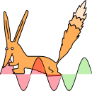
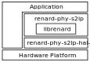

# `renard-phy-s2lp` - Sigfox Protocol Physical Layer for S2-LP

`renard-phy-s2lp` is an open source physical layer implementation of the Sigfox protocol's uplink and downlink for STMicroelectronics' S2-LP ultra-low power transceiver chip. It uses [`librenard`](https://github.com/Jeija/librenard) internally for encoding and decoding of Sigfox frames. `renard-phy-s2lp` only supports regulatory zones "RC1" (Europe / Overseas France / Middle East and Africa) and RC2 (North America and Brazil).

It does not directly interface with the S2-LP, but through a Hardware Abstraction Layer (HAL). Moreover, it only depends on functionality provided by the C standard library. This makes it possible to port this driver to various different Microcontroller platforms and processor architectures.

Currently, the following hardware abstraction layers (with their respective demo applications) exist:

Platform | HAL | Demo Application
---:|:---:|:---:
Espressif ESP32 | [renard-phy-s2lp-hal-esp32](https://github.com/Jeija/renard-phy-s2lp-hal-esp32) | [renard-phy-s2lp-demo-esp32](https://github.com/Jeija/renard-phy-s2lp-demo-esp32)
HT Micron HT32SX | [renard-phy-s2lp-hal-stm32](https://github.com/Jeija/renard-phy-s2lp-hal-stm32) | [renard-phy-s2lp-demo-ht32sx](https://github.com/Jeija/renard-phy-s2lp-demo-ht32sx)
STMicroelectronics STM32L0 | [renard-phy-s2lp-hal-stm32](https://github.com/Jeija/renard-phy-s2lp-hal-stm32) | [renard-phy-s2lp-demo-stm32](https://github.com/Jeija/renard-phy-s2lp-demo-stm32)

# Usage
See the applications listed in the table above for sample code that demonstrates how to integrate `renard-phy-s2lp` into your project.

# Attribution
`renard-phy-s2lp` was partly created by carefully studying the source code of STMicroelectronics' STM32Cube Software Expansion ["X-CUBE-SFOX"](https://www.st.com/en/embedded-software/x-cube-sfox.html).

# Licensing
`renard-phy-s2lp` is licensed under the MIT License. See `LICENSE` for details.